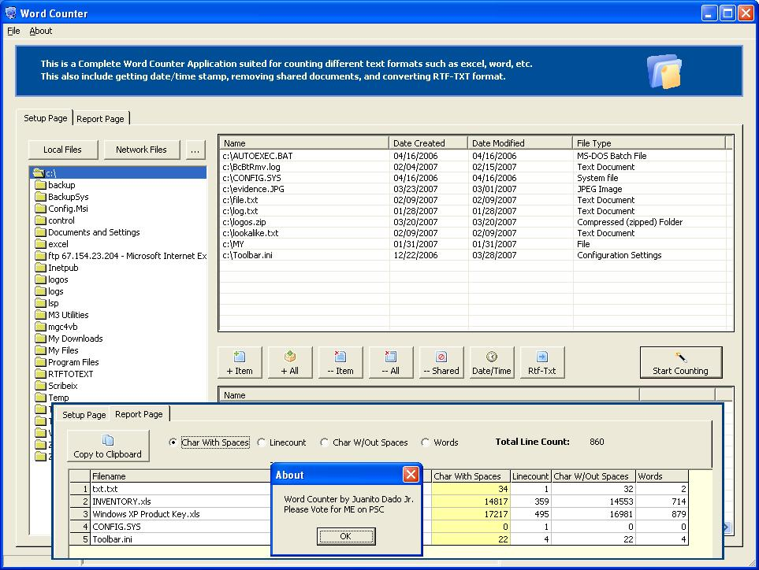



## A Complete Word Counter/Converter \( Updated \)

### Description

An update of the Complete Word Counter/Converter. Counts any file format by batch. Coverts RTF to TEXT, Remove shared etc. Basically this is full on examples on how you can manipulate the word object to do the job. Once you know the basic VBA and macros, you can do almost anything with this. This is useful when you're using office apps. Converting to any kind of format is a breeze. Whether rtf-txt, txt-rtf, xls-word, word-csv,csv-xls etc etc. If you find this useful, then dont forget to vote. Thanks!
 
### More Info
 

             |
---                |---
**Submitted On**   |2007-03-28 04:17:44
**By**             |[Juanito Dado Jr](https://github.com/Planet-Source-Code/PSCIndex/blob/master/ByAuthor/juanito-dado-jr.md)
**Level**          |Beginner
**User Rating**    |5.0 (15 globes from 3 users)
**Compatibility**  |VB 5\.0, VB 6\.0
**Category**       |[Microsoft Office Apps/VBA](https://github.com/Planet-Source-Code/PSCIndex/blob/master/ByCategory/microsoft-office-apps-vba__1-42.md)
**World**          |[Visual Basic](https://github.com/Planet-Source-Code/PSCIndex/blob/master/ByWorld/visual-basic.md)
**Archive File**   |[A\_Complete2056603282007\.zip](https://github.com/Planet-Source-Code/juanito-dado-jr-a-complete-word-counter-converter-updated__1-68230/archive/master.zip)

